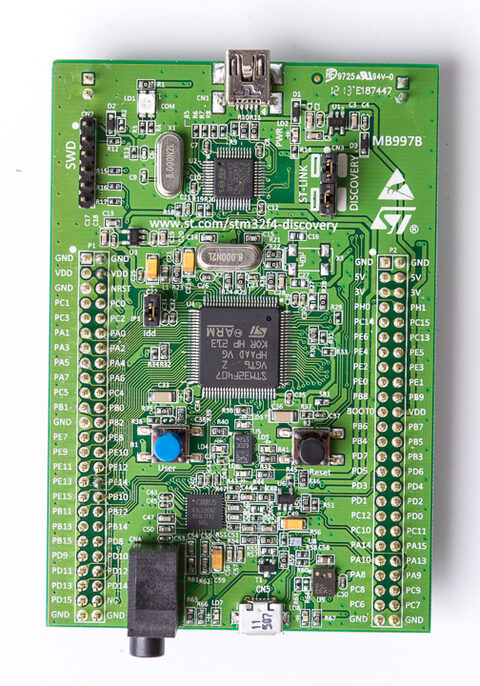

# STM32F4DISCOVERY



The `stm32f4discovery` target supports the STM32F407VGT6 board with a
USART2 console (interrupt-driven receive, polled transmit), shell/VFS, and 1 kHz SysTick. It uses the 16 MHz internal HSI
clock, software floating point, 1 MB flash, and 128 KB main SRAM, of which
80 KB hold two ramdisks formatted at every boot: FAT at `/ram` (64 KB) and
littlefs at `/lfs` (16 KB). Their contents are lost on reset. The separate 64 KB CCM RAM is unused. USB, audio, sensors, and hardware FPU context switching
are not implemented. SVC/PendSV remain the existing panic handlers.

Build with an Arm GNU bare-metal toolchain, CMake, Ninja, and Python:

```bash
git submodule update --init --recursive
python3 -m venv .venv
.venv/bin/pip install -r requirements.txt
cmake --preset stm32f4discovery -DPython3_EXECUTABLE="$PWD/.venv/bin/python"
cmake --build --preset stm32f4discovery
```

The ELF is `build/stm32f4discovery/homecore`; the raw flash image is
`build/stm32f4discovery/homecore.bin`. With OpenOCD installed and the on-board
ST-LINK connected (CN3 jumpers fitted), program and reset with:

```bash
openocd -f board/stm32f4discovery.cfg \
  -c "program build/stm32f4discovery/homecore verify reset exit"
```

Connect a **3.3 V USB-to-UART adapter** and use **115200 baud, 8N1, no flow control**:

| Board pin | Adapter pin |
| --- | --- |
| PA2 (USART2 TX) | RX |
| PA3 (USART2 RX) | TX |
| GND | GND |

Power the board through its ST-LINK USB connector; leave the adapter power pin
disconnected. Keep BOOT0 low for flash boot. The console appears as `/dev/uart0`.
The original STM32F4DISCOVERY has ST-LINK/V2 and needs an external UART adapter.
The STM32F407G-DISC1 has ST-LINK/V2-A with VCP support, but its UART pins are
not connected to the target by default. To use that VCP, connect PA2 (P1 pin 14)
to U2 pin 13 (ST-LINK RX), and PA3 (P1 pin 13) to U2 pin 12 (ST-LINK TX).
These are added wires to the ST-LINK MCU pins, not the CN3 SWD jumpers. See [ST's board manual (UM1472)](https://www.st.com/resource/en/user_manual/um1472-stm32f4-discovery-stmicroelectronics.pdf).
Configure the terminal to display LF as a new line; press Enter to submit commands.

After reset, check the HomeCore banner and prompt, then run `help`, `mem`,
`uptime`, `cat /dev/uptime`, `mkdir /tmp`, `touch /tmp/test`, `ls /tmp`,
`cp /dev/uptime /ram/boot`, `cat /ram/boot`, `cp /ram/boot /lfs/boot`,
`ls /ram /lfs`, `write /dev/led0 on` (LD4 green lights; `cat /dev/led0`
prints 1), the same for `led1` (LD3 orange), `led2` (LD5 red), and `led3`
(LD6 blue), `write /dev/led0 toggle`, and `reboot`. The user LEDs on PD12-PD15
are driven through the GPIOD port; this has not been checked on hardware. Uptime accuracy follows HSI oscillator tolerance. Received bytes are
buffered by the USART interrupt in a 64-byte ring, so pasted input is no longer
limited to the one-byte data register; bytes beyond a full ring are dropped.
This has not yet been checked on hardware.

This port has been cross-compiled and its linked layout checked. The `/ram`
FAT and `/lfs` littlefs volumes are covered by host tests with the same driver
and filesystem code, not yet on the board. The existing
LM3S6965EVB QEMU command regression passes; STM32 hardware validation is still
required. ST's pinned CMSIS device headers and license are in `external/stm32f4`.

See [development](../development.md) for prerequisites and validation commands.

Clock startup waits use a finite iteration budget because SysTick is not running
yet. HSI readiness or clock-switch failure enters the fatal halt path before UART
initialization; diagnose that silent failure with a debugger.

Photo: [Teardown Central](https://commons.wikimedia.org/wiki/File:STM32F4_Discovery_(9067300323).jpg), [CC BY-SA 2.0](https://creativecommons.org/licenses/by-sa/2.0/), resized; see [photo credits](../assets/boards/PHOTOS.md).
